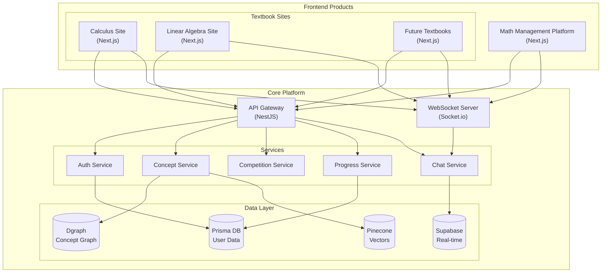
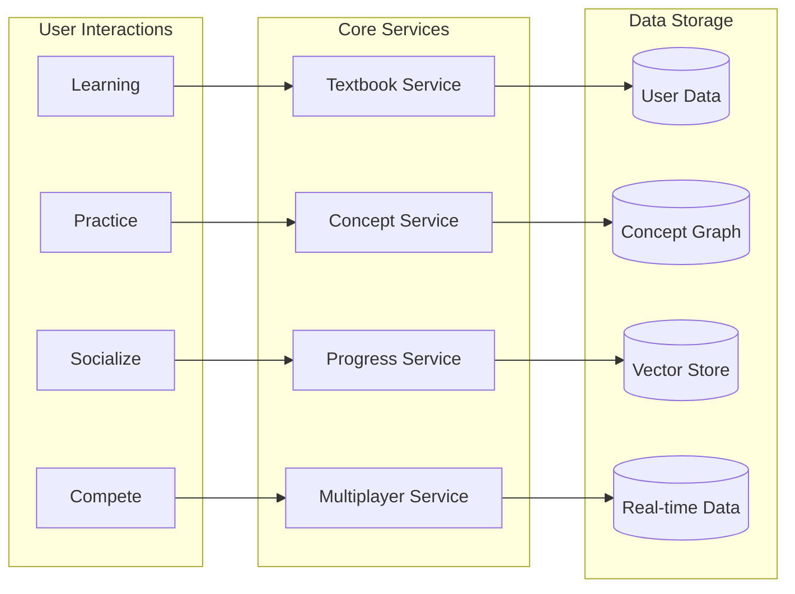
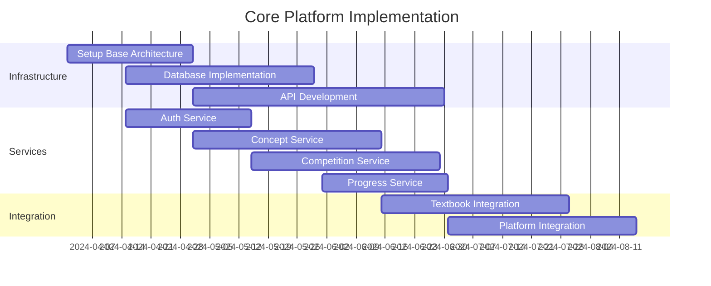
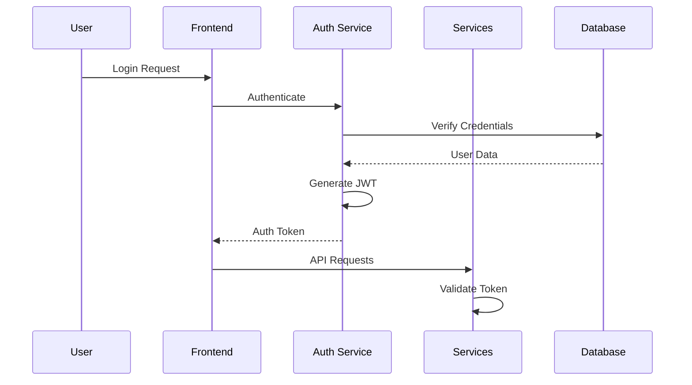

# Math-Core Platform Architecture

## Product Ecosystem Overview

The Math-Core ecosystem consists of multiple interconnected products sharing a centralized data platform (数据中台). This architecture document outlines how these products work together to create a comprehensive mathematics learning environment.

### Product Architecture

### Data Flow Architecture

## System Evolution

### MVP Stage (0-6 months)
- Core platform with basic services
- One textbook site implementation
- Basic management platform
- Essential multiplayer features

### Growth Stage (6-12 months)
- Multiple textbook sites
- Enhanced competition system
- Advanced concept mapping
- Improved real-time features

### Scale Stage (12+ months)
- Automated textbook integration
- Advanced AI features
- Global deployment
- Enhanced analytics

## Implementation Strategy

### 1. Core Platform Development

### 2. Textbook Site Template
- Standardized Next.js template
- Shared components library
- Consistent styling system
- Integration patterns

### 3. Management Platform
- Concept visualization
- Competition management
- Progress tracking
- Community features

## Technical Stack

### Frontend (All Products)
- Next.js for web applications
- Tailwind CSS for styling
- Socket.io for real-time
- Shared component library

### Backend (Core Platform)
- NestJS for microservices
- GraphQL + REST APIs
- WebSocket integration
- Service mesh architecture

### Data Layer
- PostgreSQL (Prisma)
- Dgraph
- Pinecone
- Supabase

### Infrastructure
- Docker containers
- Kubernetes orchestration
- CI/CD pipelines
- Monitoring system

## Security Architecture

### Authentication Flow

## Monitoring and Analytics

### Data Collection
- User learning patterns
- Competition metrics
- System performance
- Error tracking

### Analysis
- Learning effectiveness
- Feature usage
- Performance metrics
- User engagement

## Deployment Strategy

### MVP Deployment
- Single region
- Basic scaling
- Essential monitoring
- Core features only

### Growth Deployment
- Multi-region support
- Advanced scaling
- Full monitoring
- Feature expansion

### Scale Deployment
- Global CDN
- Auto-scaling
- Predictive analytics
- Advanced features
