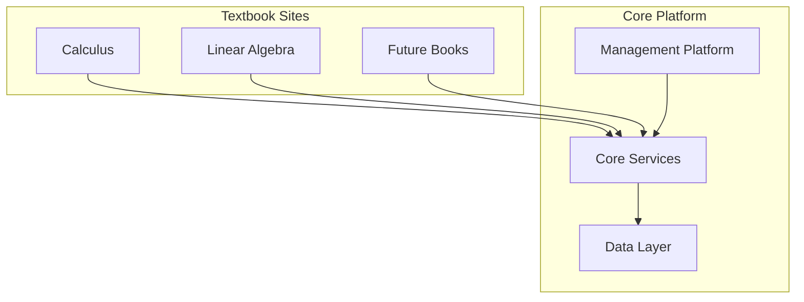

# Mathematics Learning Ecosystem

A comprehensive mathematics learning platform ecosystem consisting of a central management system and gamified textbook sites. The platform uses advanced technologies to create an engaging, interactive learning experience through concept visualization, competitions, and real-time collaboration.

## Product Ecosystem



### Components

1. **Math Management Platform**
   - Central hub for learning management
   - Competition system
   - Progress tracking
   - Community features

2. **Textbook Sites**
   - Individual sites for each textbook
   - Gamified learning experience
   - Interactive exercises
   - Real-time progress sync

3. **Core Platform**
   - Shared authentication
   - Centralized data management
   - API gateway
   - Real-time services

## Features

### MVP Stage
- ✨ User authentication and profiles
- 📚 Basic concept visualization
- 🎮 Three competition types:
  - Feynman Technique
  - Problem Solving
  - Multiple Choice
- 💬 Basic chat and community features
- 📊 Progress tracking

### Future Roadmap
- 📱 Mobile application
- 🤖 Advanced AI features
- 🌐 Global deployment
- 📈 Enhanced analytics

## Technology Stack

### Frontend
- Next.js
- Tailwind CSS
- Socket.io
- Shared component library

### Backend
- NestJS
- GraphQL + REST
- WebSocket
- Service mesh

### Data Layer
- PostgreSQL (Prisma)
- Dgraph (Concept Graph)
- Pinecone (Vector Search)
- Supabase (Real-time)

## Project Structure

```
mathematic-management-system/
├── core/                   # Core backend services
│   ├── src/               # Source code
│   └── prisma/            # Database schema
├── web/                   # Management platform frontend
│   ├── app/              # Next.js application
│   └── components/       # Shared components
└── textbook-sites/        # Textbook site templates
    └── template/         # Base template for new sites
```

## Getting Started

### Prerequisites
- Node.js >= 18
- PostgreSQL
- Dgraph
- Pinecone API key
- Supabase account

### Installation

1. **Core Platform**
```bash
cd core
npm install
cp .env.example .env  # Configure your environment variables
npm run prisma:generate
npm run prisma:migrate
npm run start:dev
```

2. **Management Platform**
```bash
cd web
npm install
cp .env.example .env  # Configure your environment variables
npm run dev
```

3. **Textbook Site Template**
```bash
cd textbook-sites/template
npm install
cp .env.example .env  # Configure your environment variables
npm run dev
```

## Development Guidelines

### Core Platform Development
1. Follow microservice architecture principles
2. Implement comprehensive testing
3. Document API endpoints
4. Monitor performance metrics

### Textbook Site Development
1. Use the standard template
2. Follow shared component guidelines
3. Maintain consistent styling
4. Implement required integrations

### Code Style
- ESLint configuration
- Prettier formatting
- TypeScript strict mode
- Component documentation

## Testing

```bash
# Core platform tests
cd core
npm run test
npm run test:e2e

# Management platform tests
cd web
npm run test
```

## Deployment

### MVP Deployment
- Single region setup
- Basic monitoring
- Essential features only

### Production Deployment
- Multi-region support
- Advanced monitoring
- Full feature set
- Auto-scaling

## Contributing

1. Fork the repository
2. Create your feature branch
3. Commit your changes
4. Push to the branch
5. Create a Pull Request

## Documentation

- [Architecture Guide](ARCHITECTURE.md)
- [Requirements Specification](REQUIREMENTS.md)
- [API Documentation](core/docs/API.md)
- [Component Library](web/docs/COMPONENTS.md)

## License

This project is licensed under the MIT License - see the [LICENSE](LICENSE) file for details.

## Contact

For any inquiries about the platform or collaboration opportunities, please reach out to the development team.

## Acknowledgments

- Mathematics education experts
- Open source community
- Early adopters and testers 