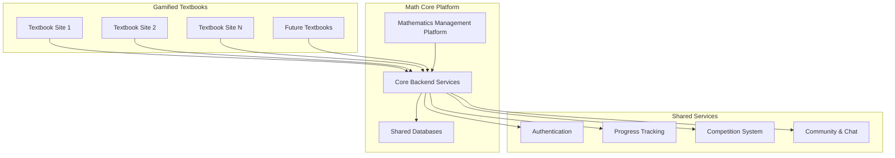
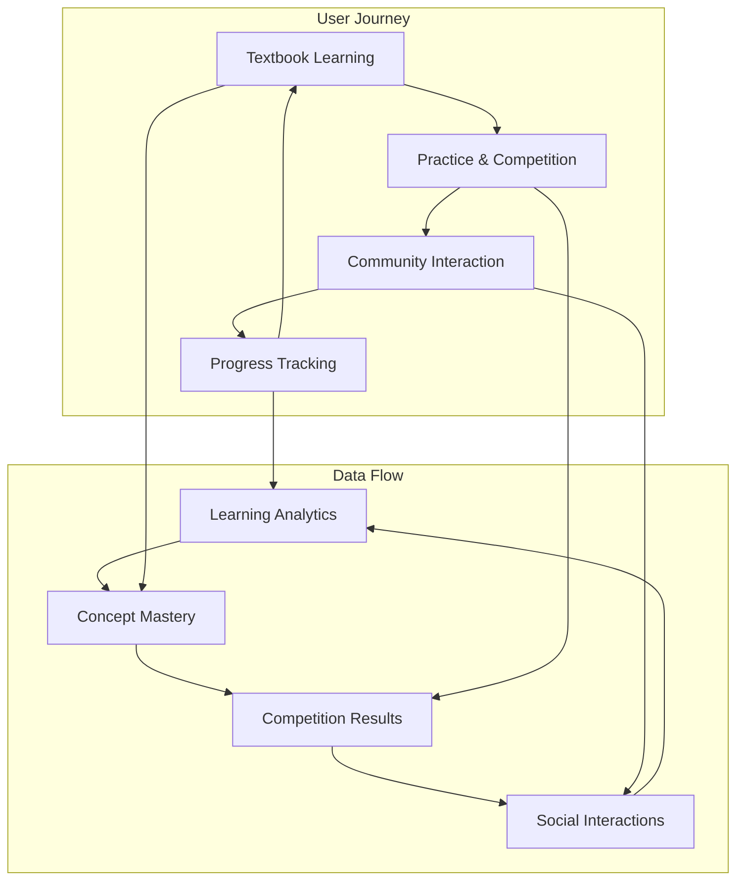
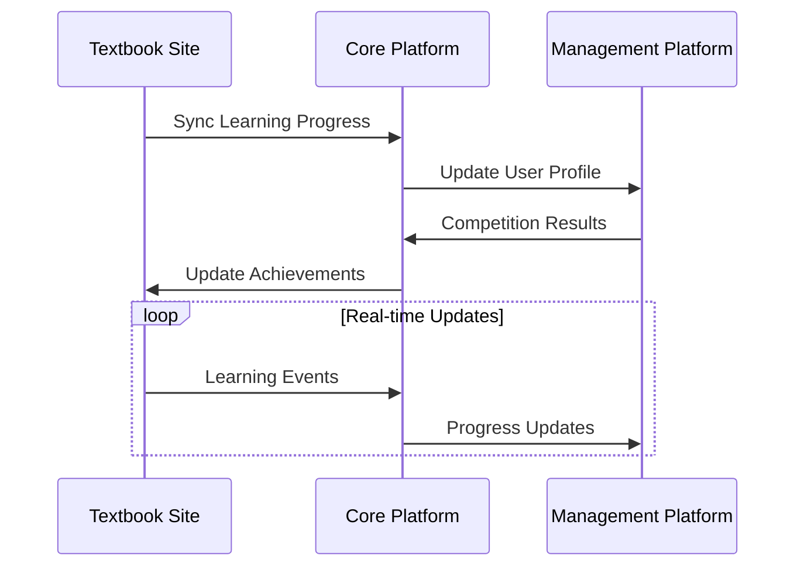
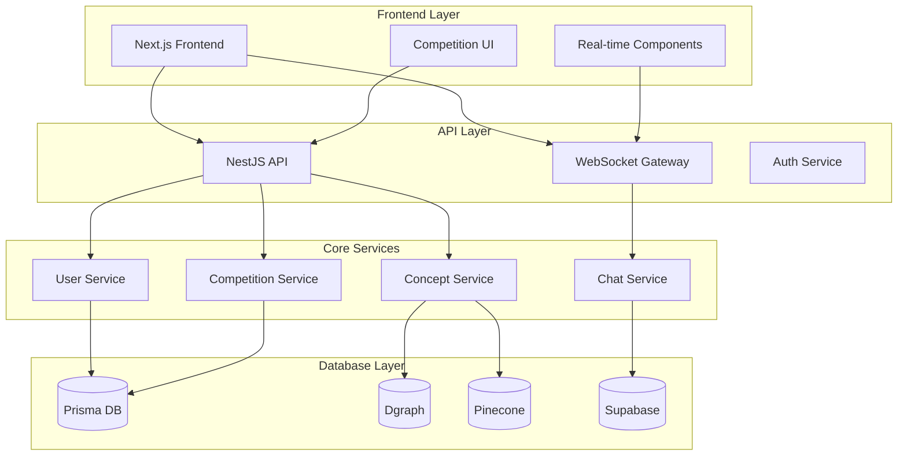
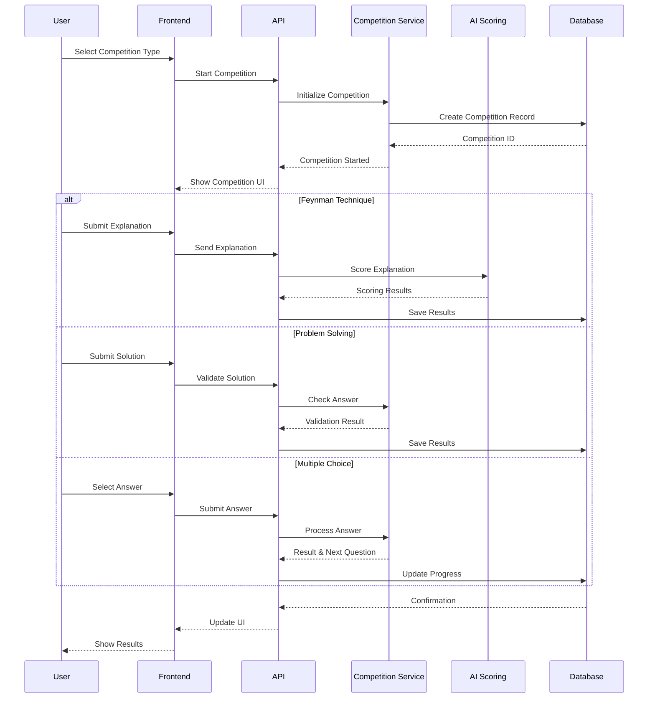
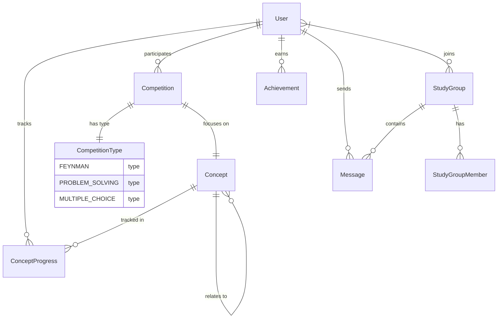
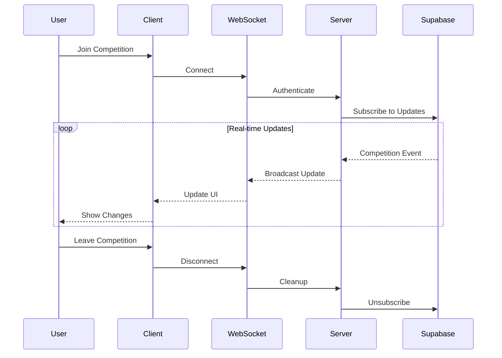

# Mathematics Management System Requirements

## Product Ecosystem Overview

### Product Family


### Platform Integration


## Product Components

### 1. Math Core Platform (Backend)
- Centralized data platform (数据中台)
- Shared services and APIs
- Database management
- Authentication and authorization
- Analytics and tracking

### 2. Mathematics Management Platform (Frontend)
- Concept visualization and navigation
- Competition system
- Community features
- Progress tracking
- Multiplayer elements

### 3. Gamified Textbook Sites
- Individual sites per textbook
- Consistent UI/UX across sites
- Textbook-specific content
- Shared authentication
- Connected progress tracking

## Integration Points

### Data Synchronization


## System Overview

### System Architecture


### Competition Flow


### Data Relationships


### Real-time Communication


## Design Thinking

### 1. Empathize
**Target Users:**
- Students learning mathematics
- Teachers and educators
- Self-learners
- Mathematics enthusiasts

**Pain Points:**
- Difficulty in connecting mathematical concepts
- Lack of engaging practice methods
- Challenge in explaining concepts to others
- Need for real-time feedback and assessment
- Desire for competitive learning environment

### 2. Define
**Core Problems:**
1. Traditional learning methods are often passive and disconnected
2. Students struggle to articulate mathematical concepts
3. Limited opportunities for peer-to-peer learning
4. Lack of immediate feedback on understanding
5. Need for gamification to maintain engagement

### 3. Ideate
**Solution Approaches:**
1. Graph-based concept visualization
2. Gamified learning through competitions
3. Real-time peer interaction
4. AI-assisted feedback
5. Progress tracking and achievements

### 4. MVP Solution
Focus on three core competition types that are simple yet effective:
1. Feynman Technique Competition
2. Problem Solving Competition
3. Multiple Choice Competition

## User Stories

### Student Stories
```agile
As a student
I want to visualize how mathematical concepts connect
So that I can understand their relationships better

As a student
I want to practice explaining concepts
So that I can deepen my understanding

As a student
I want to compete with others
So that I can stay motivated and gauge my progress

As a student
I want to track my progress
So that I can identify areas for improvement

As a student
I want to interact with peers
So that I can learn from their perspectives
```

### Teacher Stories
```agile
As a teacher
I want to monitor student progress
So that I can provide targeted assistance

As a teacher
I want to see concept relationships
So that I can better explain connections to students

As a teacher
I want to review student explanations
So that I can assess their understanding
```

## Competition System (MVP)

### 1. Feynman Technique Competition
**Implementation:**
- Simple text-based explanation input
- AI scores based on:
  - Clarity (30%)
  - Completeness (30%)
  - Accuracy (40%)
- No complex video/audio in MVP
- Real-time scoring
- Leaderboard for each concept

**Flow:**
1. User selects a concept
2. System provides prompt for explanation
3. User types explanation
4. AI immediately scores
5. Score is recorded and ranked

### 2. Problem Solving Competition
**Implementation:**
- Text-based problem input
- Simple numerical or algebraic answers
- Automated checking against known solutions
- Time-based scoring
- No step-by-step validation in MVP

**Flow:**
1. User joins competition
2. System presents problem
3. User submits answer
4. Immediate validation
5. Score based on correctness and time

### 3. Multiple Choice Competition
**Implementation:**
- Simple 4-option format
- Time-limited responses
- Instant feedback
- Points based on speed and accuracy
- Basic difficulty progression

**Flow:**
1. User starts quiz
2. Questions appear one at a time
3. User selects answer
4. Immediate feedback
5. Final score calculation

## System Architecture

### Database Architecture
1. **Relational Database (Prisma)**
   - User management and authentication
   - Competition records and scores
   - Achievement tracking
   - Chat and community features
   - Basic analytics

2. **Graph Database (Dgraph)**
   - Mathematics concepts network
   - Concept relationships and dependencies
   - Learning paths
   - User progress mapping
   - Textbook concept mapping

3. **Vector Database (Pinecone)**
   - Concept embeddings for similarity search
   - Problem similarity matching
   - Content recommendation
   - Search optimization

4. **Real-time Database (Supabase)**
   - Live competition updates
   - Chat system
   - Online presence
   - Real-time notifications

### Real-time Features (MVP)
- Basic text chat
- Group discussions for concepts
- Competition status updates
- Simple online presence indicator
- No private messaging or file sharing in MVP

### Security Requirements
- JWT-based authentication
- Role-based access control
- Rate limiting for competitions
- Basic input validation
- Simple API security

### Performance Requirements
- < 2s response time for competitions
- < 1s for chat messages
- Support for 100 concurrent users
- Basic caching
- Single region deployment

## Future Considerations (Post-MVP)

### Enhanced Competition Features
1. Video/Audio explanations
2. Peer review system
3. Team competitions
4. Custom competition creation

### Advanced Features
1. AI-generated practice problems
2. Interactive visualizations
3. Mobile app
4. Advanced analytics

### Community Features
1. Mentorship system
2. Content creation tools
3. Advanced moderation
4. Reputation system

## Core System Components

### Database Architecture
1. **Relational Database (Prisma)**
   - User management
   - Authentication
   - User progress tracking
   - Competition records
   - Scores and achievements

2. **Graph Database (Dgraph)**
   - Mathematics concepts network
   - Concept relationships
   - Learning paths
   - User concept mastery mapping
   - Textbook concept mapping

3. **Vector Database (Pinecone)**
   - Concept embeddings
   - Semantic search
   - Similar concept discovery
   - Problem similarity matching

4. **Real-time Database (Supabase)**
   - Live chat
   - Community discussions
   - Real-time notifications
   - PVP/PVE status updates
   - Online presence tracking

### Core Features

#### User Management
- User registration and authentication
- Profile management
- Progress tracking
- Achievement system
- Learning history

#### Concept Management
- Concept creation and editing
- Relationship mapping
- Concept hierarchy
- Textbook mapping
- Learning path generation

#### Competition System
1. **Feynman Technique Competition**
   - Concept explanation recording
   - AI-based scoring system
   - Real-time evaluation
   - Peer review system

2. **Problem Solving Competition**
   - Real-time problem solving
   - Solution submission
   - Automated grading
   - Time tracking
   - Difficulty scaling

3. **Multiple Choice Competition**
   - Timed quizzes
   - Dynamic difficulty
   - Score tracking
   - Performance analytics

#### Community Features
- Real-time chat
- Discussion forums
- Study groups
- Concept discussions
- Problem solving collaboration

### MVP Features Priority
1. Basic user management
2. Core concept mapping
3. Simple competition system
4. Basic real-time features
5. Essential community features

## Technical Requirements

### Backend (/core)
- NestJS framework
- Prisma ORM
- Dgraph integration
- Pinecone integration
- Supabase real-time
- GraphQL API
- REST API endpoints
- WebSocket support
- Authentication/Authorization
- Rate limiting

### Frontend (/web)
- Next.js framework
- Real-time updates
- Interactive concept visualization
- Competition interfaces
- Chat system
- Responsive design
- Progressive loading
- Offline support

### Security Requirements
- JWT authentication
- Role-based access control
- Data encryption
- API security
- Rate limiting
- Input validation
- XSS protection
- CSRF protection

### Performance Requirements
- < 100ms API response time
- Real-time updates < 50ms
- 99.9% uptime
- Scalable to 100k users
- Efficient data caching
- Optimized database queries
- CDN integration

## Future Considerations
1. Mobile application
2. Advanced AI features
3. AR/VR integration
4. Advanced analytics
5. Teacher dashboard
6. Content creation tools
7. Integration with LMS systems
8. Advanced competition modes 