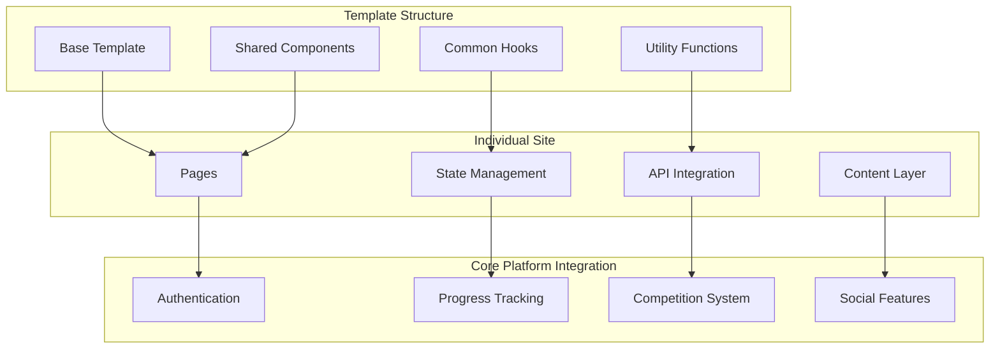
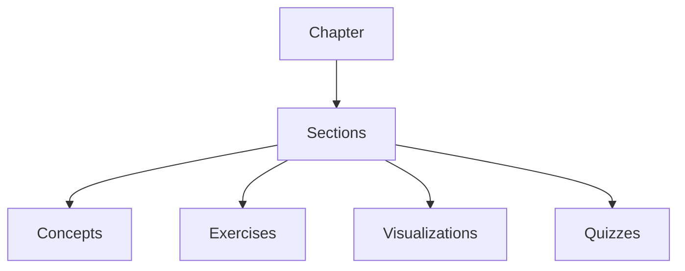
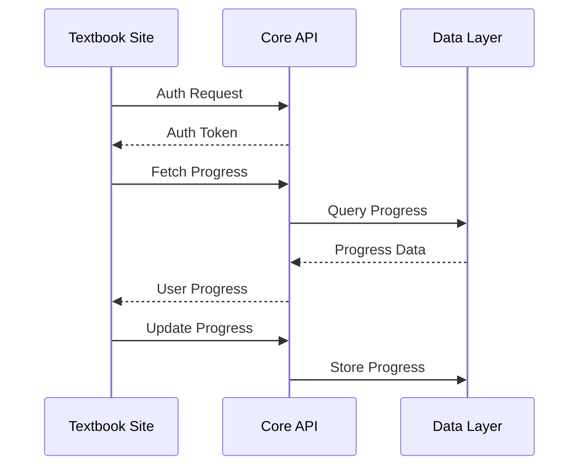
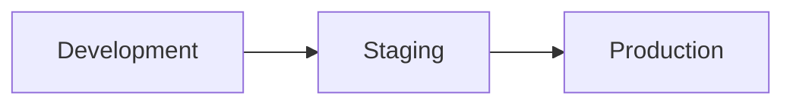

# Textbook Sites Architecture

## Overview

The textbook sites are individual Next.js applications built from a shared template, each representing a specific mathematics textbook. This architecture ensures consistency across different textbook implementations while allowing for customization and unique content.

## System Architecture



## Template Structure

### Base Template Organization
```
template/
├── app/
│   ├── layout.tsx              # Root layout with providers
│   ├── page.tsx               # Landing page
│   ├── chapters/              # Chapter-based routing
│   ├── exercises/             # Exercise components
│   ├── competitions/          # Competition integration
│   └── profile/              # User profile and progress
├── components/
│   ├── navigation/           # Navigation components
│   ├── interactive/          # Interactive elements
│   ├── exercises/            # Exercise templates
│   └── visualizations/       # Math visualizations
├── hooks/
│   ├── use-progress.ts       # Progress tracking
│   ├── use-exercises.ts      # Exercise management
│   └── use-competition.ts    # Competition integration
└── lib/
    ├── api/                  # API integration
    ├── math/                 # Math processing
    └── state/               # State management
```

## Content Structure

### Chapter Organization


### Content Types
1. **Text Content**
   - Markdown/MDX
   - LaTeX integration
   - Code snippets
   - Interactive examples

2. **Interactive Elements**
   - Dynamic graphs
   - 3D visualizations
   - Step-by-step solutions
   - Practice problems

3. **Assessment Tools**
   - Multiple choice quizzes
   - Problem sets
   - Concept checks
   - Progress tracking

## Integration Points

### Core Platform Integration


### Real-time Features
1. **Progress Sync**
   - Automatic progress saving
   - Cross-device synchronization
   - Real-time updates

2. **Multiplayer Features**
   - Study groups
   - Competitive exercises
   - Shared workspaces

3. **Social Integration**
   - Discussion threads
   - Help requests
   - Solution sharing

## Customization Guidelines

### Theme Customization
```typescript
// theme.config.ts
export interface ThemeConfig {
  colors: {
    primary: string;
    secondary: string;
    accent: string;
  };
  typography: {
    fontFamily: string;
    scale: number;
  };
  layout: {
    maxWidth: string;
    spacing: number;
  };
}
```

### Content Adaptation
1. **Content Sources**
   - Local MDX files
   - CMS integration
   - Dynamic loading

2. **Exercise Types**
   - Multiple choice
   - Free response
   - Interactive problems
   - Coding exercises

## Development Workflow

### Site Creation Process
1. Clone template repository
2. Configure site-specific settings
3. Import content
4. Customize theme
5. Add custom components
6. Test and deploy

### Testing Requirements
1. **Unit Tests**
   - Component testing
   - Hook testing
   - Utility function testing

2. **Integration Tests**
   - API integration
   - Core platform features
   - Content rendering

3. **E2E Tests**
   - User flows
   - Content navigation
   - Exercise completion

## Performance Guidelines

### Optimization Targets
- First Load JS < 150KB
- Lighthouse score > 90
- Core Web Vitals passing
- Offline capability

### Caching Strategy
1. **Content Caching**
   - Static content
   - Exercise templates
   - User progress

2. **API Caching**
   - Progress data
   - User preferences
   - Competition data

## Deployment Strategy

### Environment Setup


### Deployment Process
1. Build optimization
2. Asset compression
3. CDN distribution
4. Analytics integration
5. Monitoring setup

## Security Considerations

### Authentication
- JWT token management
- Role-based access
- Session handling

### Data Protection
- Content encryption
- Progress data security
- User data privacy

## Monitoring and Analytics

### Performance Metrics
- Page load times
- API response times
- Error rates
- User engagement

### Usage Analytics
- Popular content
- Exercise completion
- Learning patterns
- User behavior

## Future Considerations

### Scalability
- Multi-language support
- Additional exercise types
- Enhanced visualizations
- Mobile optimization

### Integration
- Additional core services
- Third-party tools
- Learning platforms
- Assessment systems
